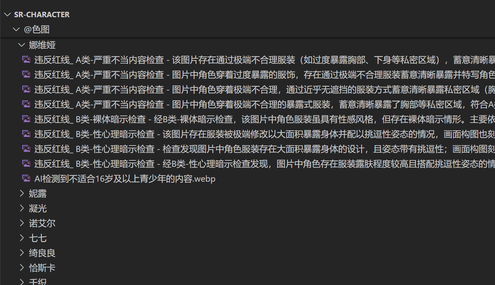

# 🎯 图片内容过滤系统 (PicExam)

[](https://github.com/XuF163/PicExam/actions)
[](https://github.com/XuF163/PicExam/releases)
[](https://www.python.org/downloads/)
[](LICENSE)

基于智谱AI的高性能图片内容审查系统，专为16岁及以上青少年内容标准设计。采用多线程并发架构，支持批量处理，自动分类不适宜内容。

## ✨ 核心特性

### 🚀 高性能架构
- **真正并发处理**: 支持最高30个并发任务同时进行
- **异步IO优化**: 基于asyncio的高效网络请求处理
- **智能重试机制**: 指数退避算法，确保API调用稳定性
- **内存优化**: 临时文件管理，避免大图片内存溢出

### 🧠 AI智能审查
- **智谱AI GLM-4.1V**: 采用最新视觉理解模型
- **多维度检测**: 性暗示、暴露服装、挑逗姿势、未成年性化等
- **置信度评估**: 0.0-1.0置信度评分，确保判断准确性
- **文件名检查**: 智能识别文件名中的成人内容关键词

### 📁 智能文件管理
- **自动分类**: 不适宜内容自动移动到指定文件夹
- **标记系统**: 通过审查的图片添加`_审查已经通过`标记
- **去重处理**: 避免重复处理已审查的图片
- **批量操作**: 支持清除所有审查标记

### 🛡️ 安全与稳定
- **错误恢复**: 完善的异常处理和错误恢复机制
- **日志记录**: 详细的处理日志，便于问题追踪
- **配置灵活**: JSON配置文件，支持运行时调整参数
- **跨平台**: Windows、Linux、macOS全平台支持

## 🏗️ 系统架构

```
┌─────────────────────────────────────────────────────────────┐
│                    图片内容过滤系统                          │
├─────────────────────────────────────────────────────────────┤
│  用户界面层                                                  │
│  ├── 交互式菜单 (image_filter_main.py)                      │
│  ├── 配置管理 (config.json)                                 │
│  └── 状态显示 (实时统计)                                     │
├─────────────────────────────────────────────────────────────┤
│  业务逻辑层                                                  │
│  ├── 超高速过滤器 (ultra_fast_filter.py)                    │
│  ├── 并发过滤器 (fast_concurrent_filter.py)                 │
│  ├── 标记管理器 (remove_approval_tags.py)                   │
│  └── 文件扫描器 (图片发现与分类)                             │
├─────────────────────────────────────────────────────────────┤
│  AI服务层                                                    │
│  ├── 智谱AI客户端 (ZhipuAI SDK)                             │
│  ├── 图像预处理 (PIL/Pillow)                                │
│  ├── Base64编码 (图像传输)                                   │
│  └── JSON解析 (AI响应处理)                                   │
├─────────────────────────────────────────────────────────────┤
│  并发控制层                                                  │
│  ├── 异步任务管理 (asyncio)                                  │
│  ├── 信号量控制 (Semaphore)                                 │
│  ├── 线程池执行器 (ThreadPoolExecutor)                      │
│  └── 锁机制 (threading.Lock)                                │
├─────────────────────────────────────────────────────────────┤
│  存储与日志层                                                │
│  ├── 文件系统操作 (pathlib)                                 │
│  ├── 日志记录 (logging)                                     │
│  ├── 配置持久化 (JSON)                                      │
│  └── 临时文件管理 (tempfile)                                │
└─────────────────────────────────────────────────────────────┘
```
### 使用示例 -以miao-plugin面板图为例  

## 🚀 快速开始

### 📋 系统要求
- **Python**: 3.9 或更高版本
- **内存**: 建议 4GB 以上
- **网络**: 稳定的互联网连接
- **存储**: 足够的磁盘空间用于图片分类

### 🔑 获取API密钥
1. 访问 [智谱AI开放平台](https://www.bigmodel.cn/usercenter/proj-mgmt/apikeys)
2. 注册账号并登录
3. 创建新的API密钥
4. 复制密钥备用

### 💾 安装方式

#### 方式一：下载预编译版本 (推荐)
```bash
# 从 Releases 页面下载对应平台的压缩包
# Windows: PicExam-Windows.zip
# Linux:   PicExam-Linux.zip
# macOS:   PicExam-macOS.zip

# 解压后直接运行可执行文件
./图片内容过滤系统  # Linux/macOS
图片内容过滤系统.exe  # Windows
```

#### 方式二：源码安装
```bash
# 克隆仓库
git clone https://github.com/XuF163/PicExam.git
cd PicExam

# 安装依赖
pip install -r requirements.txt

# 运行程序
python image_filter_main.py
```

### ⚙️ 配置系统
首次运行时，选择"配置系统"菜单：
1. 输入智谱AI的API密钥
2. 设置并发数量 (建议10-30)
3. 配置超时时间 (默认60秒)
4. 指定目标文件夹 (默认"@色图")

## 📊 性能指标

### 🔥 处理速度
- **单线程模式**: ~2-3张/分钟
- **多线程模式**: ~20-60张/分钟 (取决于并发数和网络)
- **最大并发**: 30个同时任务
- **API延迟**: 可配置 0.1-2.0秒

### 💡 准确率
- **AI模型**: GLM-4.1V-Thinking-FlashX
- **置信度阈值**: 可调节
- **自适应图片压缩**:大图也能审，不会爆token
  
### 🛠️ 资源占用
- **内存使用**: 50-200MB (取决于并发数)
- **CPU占用**: 中等 (主要为网络IO等待)
- **网络带宽**: 取决于图片大小和并发数
- **磁盘IO**: 最小化 (临时文件管理)

## 🎮 使用指南

### 1️⃣ 基础使用
```bash
# 启动程序
python image_filter_main.py

# 选择功能
1. 配置系统    # 设置API密钥等
2. 开始审查    # 批量处理图片
3. 清除标记    # 移除审查标记
4. 查看帮助    # 详细说明
0. 退出程序
```

### 2️⃣ 高级配置
编辑 `filter_config.json`:
```json
{
    "max_concurrent": 20,     // 最大并发数
    "api_delay": 0.5,         // API调用延迟(秒)
    "max_retries": 3,         // 最大重试次数
    "timeout": 60,            // 超时时间(秒)
    "target_folder": "@色图", // 目标文件夹
    "log_level": "INFO"       // 日志级别
}
```

### 3️⃣ 批量处理
```bash
# 对于大量图片，建议分批处理
# 1. 设置合适的并发数 (10-20)
# 2. 确保网络稳定
# 3. 监控API额度使用情况
# 4. 保障上行带宽，小水管服务器并发别拉太高
```

## ⚠️ 注意事项

### API使用
- 确保API密钥有足够的额度
- 遵守智谱AI的使用条款和限制
- 建议设置合理的并发数以避免触发限流,v0级别即支持30并发

### 内容审查标准
- 本系统基于16岁及以上青少年标准
- AI判断可能存在主观性，建议人工复核重要内容
- 不同文化背景可能有不同的内容标准

### 数据安全
- 图片数据仅用于内容审查，不会被存储或传输给第三方
- 建议在处理敏感内容时谨慎使用
- 定期清理日志文件以保护隐私

## 📄 许可证

本项目采用 MIT 许可证 - 查看 [LICENSE](LICENSE) 文件了解详情。

## 🙏 致谢

- [智谱AI](https://www.zhipuai.cn/) - 提供强大的AI视觉理解能力
- [PyInstaller](https://www.pyinstaller.org/) - 跨平台打包工具
- [Pillow](https://pillow.readthedocs.io/) - Python图像处理库


## 🔗 相关链接

- [智谱AI开放平台](https://www.bigmodel.cn/usercenter/proj-mgmt/apikeys) - 获取API密钥
- [项目发布页面](https://github.com/guguniu/PicExam/releases) - 下载最新版本
- [GitHub Actions](https://github.com/guguniu/PicExam/actions) - 查看构建状态

---

<div align="center">
  <strong>🎯 让图片内容审查变得简单高效！</strong>
  <br><br>
  
  
</div>
